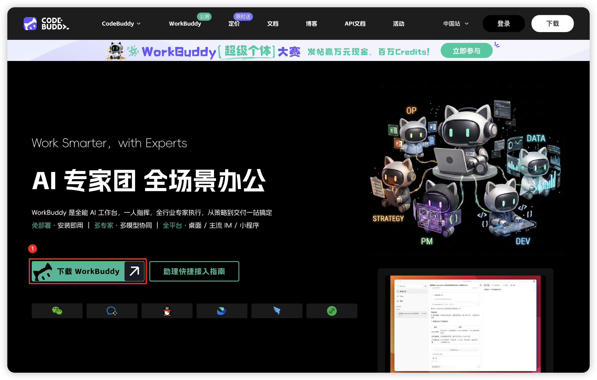
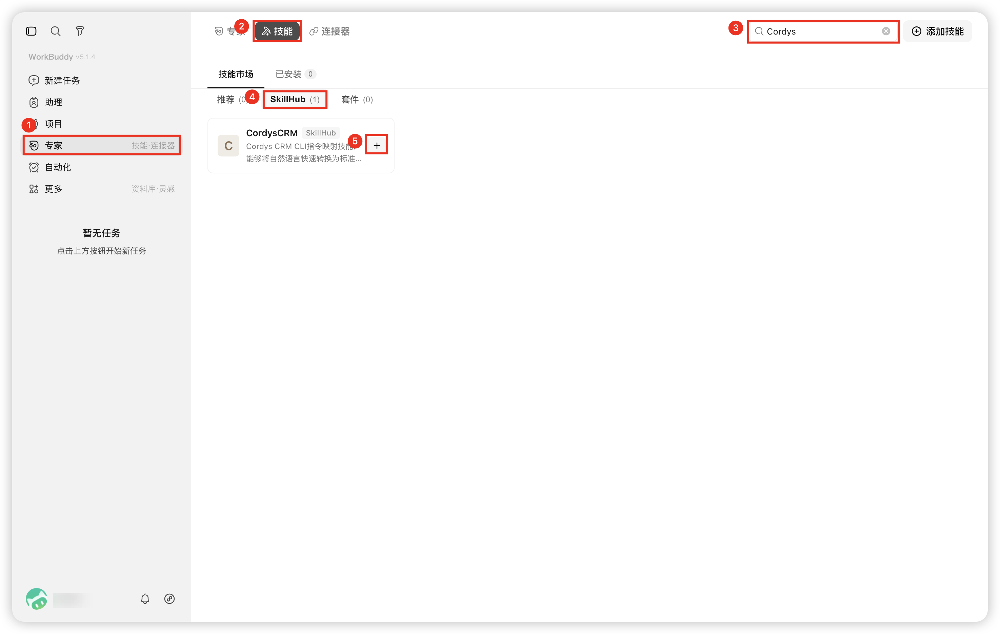
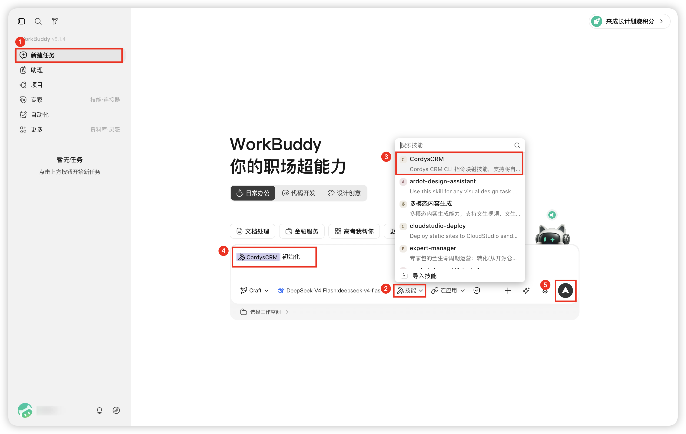
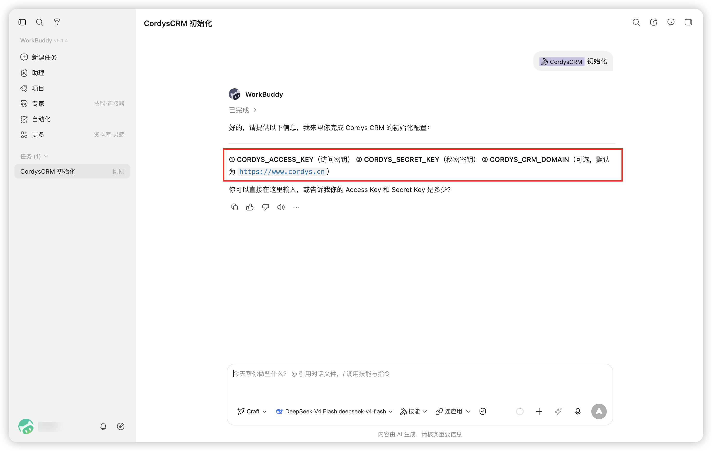
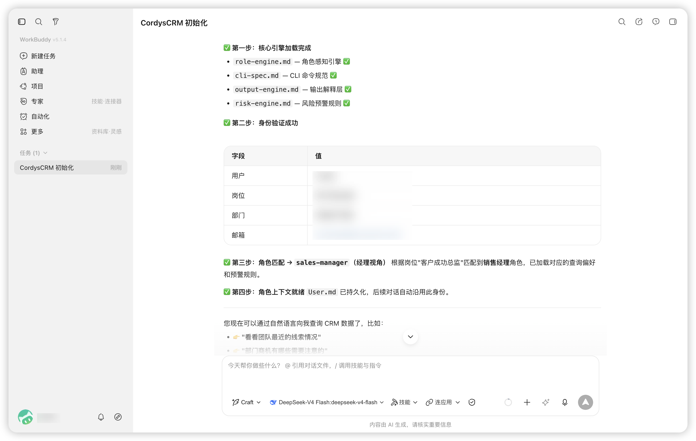
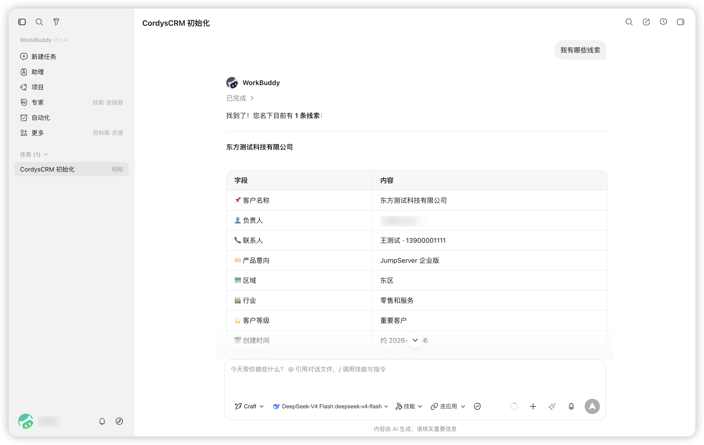
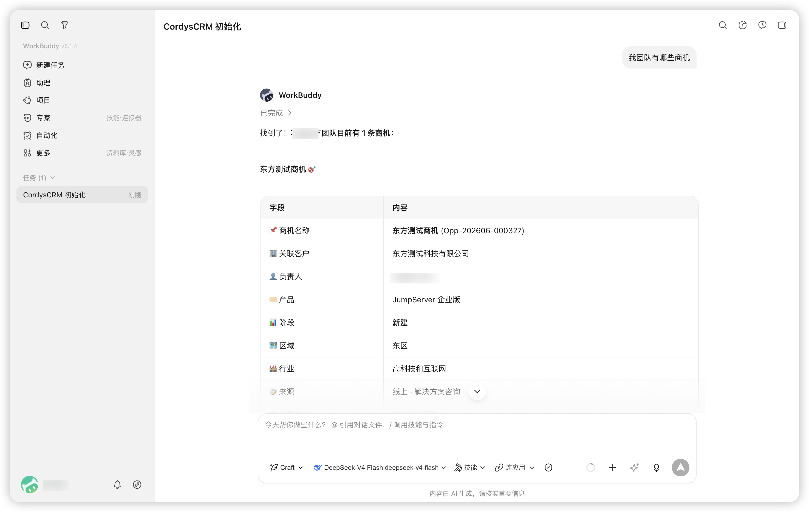
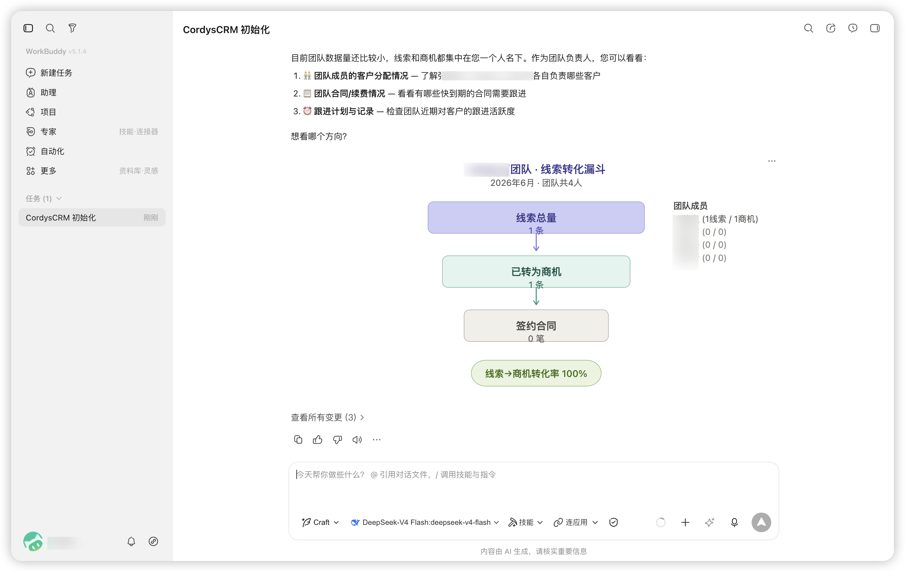
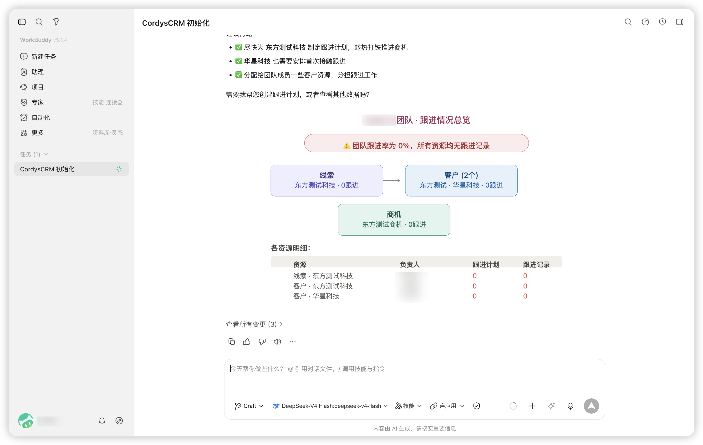

# Cordys CRM Skills for WorkBuddy

!!! Tip ""
    Cordys CRM Skills + WorkBuddy，可快速构建你的私人 AI 助理，
    像与人交谈一样与你的 Cordys CRM 工作区进行交互。

## 1 安装 WorkBuddy

!!! Tip ""
    打开 WorkBuddy 官网，点击下载 WorkBuddy，浏览器会自动匹配当前操作系统，下载合适的安装包。

## 2 Cordys CRM Skills 安装

!!! Tip ""
    仓库地址：https://github.com/1Panel-dev/CordysCRM-skills

!!! Tip ""
    在 WorkBuddy 技能市场，搜索 Cordys，直接安装。

!!! Tip ""
    安装完成后，新建任务，选择 CordysCRM，发送初始化命令。

!!! Tip ""
    根据提示，填入 API Key：

!!! Tip ""
    登录 Cordys CRM，从左下角【个人中心 - API Keys】中获取 Access Key 和 Secret Key。

!!! Tip ""
    输入相关连接信息后，Cordys CRM Skills 会自动加载用户信息，匹配用户角色，加载角色上下文。

!!! Tip ""
    不同角色对应着不同的使用偏好，Cordys CRM Skills 内置了五种角色，对应的查询偏好如下所示：

| 角色 | 关注 | 数据范围 | 主动预警 | 输出风格 |
|------|------|----------|----------|----------|
| 销售 | 我接下来该做什么？ | 我的客户 / 线索 / 商机 | 超期未跟、商机卡顿 | 优先级行动清单 |
| 经理 | 谁需要我关注？ | 全部门 + 子团队 | 跟进率低、转化骤降 | 团队看板 → 下钻到人 |
| 高管 | 公司能交付多少？ | 全公司 | 目标缺口、部门偏离 | 趋势 → 对比 → 预测 |
| 商务 | 合同签对了没有？ | 合同 + 审批流 | 到期未续、审批卡顿 | 合同状态 + 到期预警 |
| 财务 | 钱在哪？ | 合同 → 回款 → 发票 | 逾期、未开票、链断裂 | 应收全景 → 催收排序 |

## 3 Skills 模块概览

!!! Tip ""
    技能覆盖 Cordys CRM 的 L2C（Lead-to-Cash，从线索到现金）全链路。核心模块如下：

| 模块 | 自然语言叫法 | 说明 |
|------|-------------|------|
| `lead` | 线索 | 销售线索的查询、跟进、转换 |
| `account` | 客户、公司、厂商 | 客户档案、联系人、跟进记录 |
| `opportunity` | 商机、机会 | 销售机会、阶段推进、报价单 |
| `contract` | 合同 | 合同查询及其二级资源（见下） |
| `pool/lead` `pool/account` | 线索池、公海 | 未分配 / 已退回记录的领取与分配 |
| 其他模块 | —— | 可按需扩展，命令结构一致 |

!!! Tip ""
    `contract`（合同）还带一组二级资源，用于追踪资金流：

| 二级资源 | 说明 |
|----------|------|
| `contract/payment-plan` | 回款计划 |
| `contract/payment-record` | 回款记录 |
| `contract/business-title` | 工商抬头 |
| `invoice` | 发票 |
| `opportunity/quotation` | 报价单 |

## 4 使用示例

### 4.1 查询个人名下线索/客户/商机

!!! Tip ""

### 4.2 查询团队所有线索/客户/商机

!!! Tip ""

### 4.3 查询团队线索转化漏斗

!!! Tip ""

### 4.4 查询团队跟进情况

!!! Tip ""

