!!! Tip ""

     - 在左侧菜单点击【系统】-【流程设置】，进入【审批流】管理页面
     - 权限：新建审批流需要「系统管理-流程设置」的「添加」权限
     - 点击新建审批流进入流程设计页面

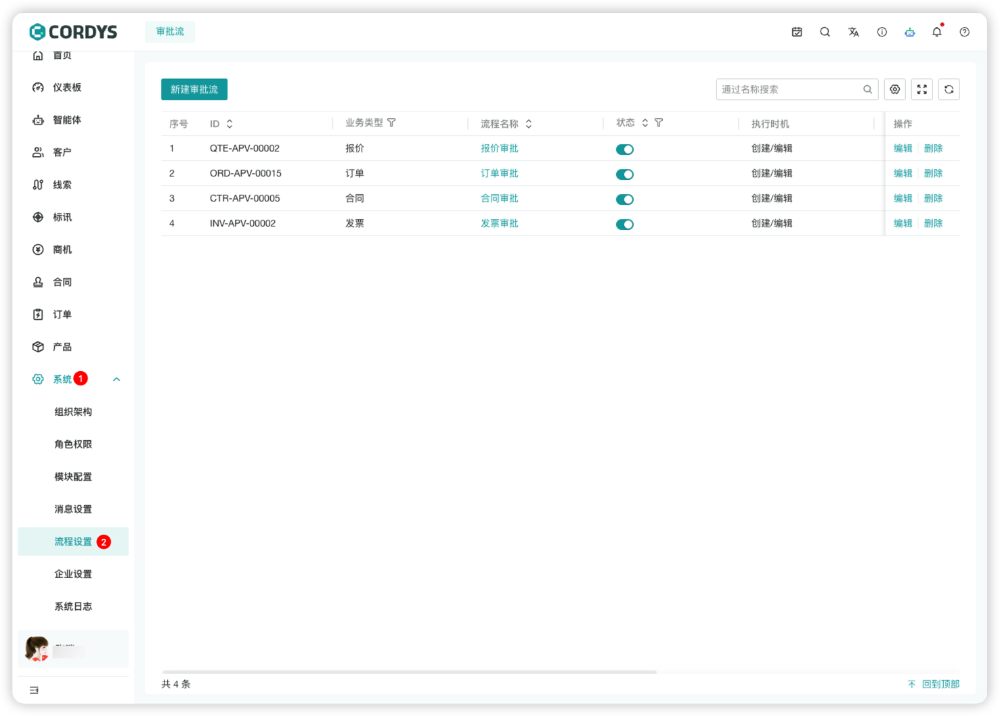

## 1 新建审批流

### 1.1 基本信息

!!! Tip ""

    #1.业务类型（必填）
          -  点击「业务类型」下拉框，选择审批流对应的业务场景（如示例中的「报价」）
          -  说明：业务类型决定了审批流将关联到哪个业务模块（报价、订单、合同等），后续该模块的单据将按此流程执行审批
          -  注意：业务类型保存后不支持修改
    #2.流程名称（必填）
        - 在「流程名称」输入框中，输入清晰、易识别的流程名称（如「报价创建审批流」）
        - 命名建议：格式为「业务场景 + 触发时机 + 审批流」，便于后续管理与识别
    #3.执行时机（必填）
        - 勾选审批流的触发时机：
            - 创建：单据新建 / 提交时触发审批（示例中已勾选）
            - 编辑：单据修改 / 更新时触发审批（按需勾选）
        - 说明：可同时勾选多个时机，满足不同业务场景的审批需求
    #4.描述信息（选填）
        - 在「描述信息」输入框中，填写流程的补充说明（如审批规则、适用范围、注意事项等），便于其他管理员理解流程用途

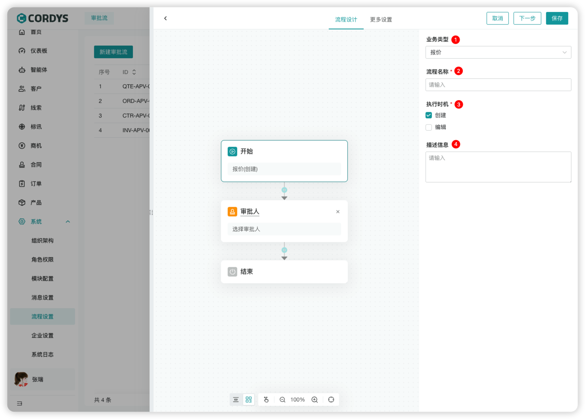

### 1.2 流程设计

!!! Tip ""

    流程设计画布采用可视化拖拽配置，基础流程包含「开始节点 - 审批节点 - 结束节点」。

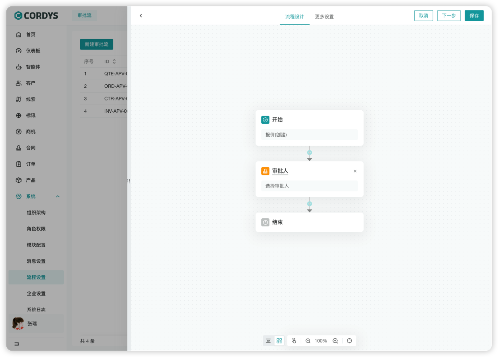

!!! Tip ""

    在「开始」节点，点击节点连接点（蓝色小圆点），可添加「审批人」节点或「触发条件」节点至画布。

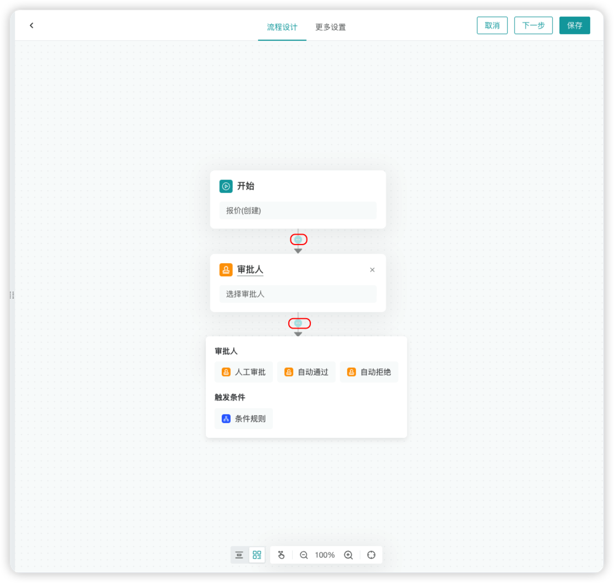

!!! Tip ""

    - **开始节点：**
        - 画布默认存在「开始」节点，点击节点可查看 / 修改审批流基本信息

!!! Tip ""
    
    - **审批人节点：**
        - 审批人节点是 Cordys 审批流的核心执行节点，用于定义谁来审批、如何审批、异常情况如何处理。支持单人 / 多人审批、多级审批、条件分支审批等多种场景，满足企业复杂的审批流程需求
        - 进入节点配置面板：点击画布中的「审批人」节点，右侧将弹出「审批人设置」面板，开始配置

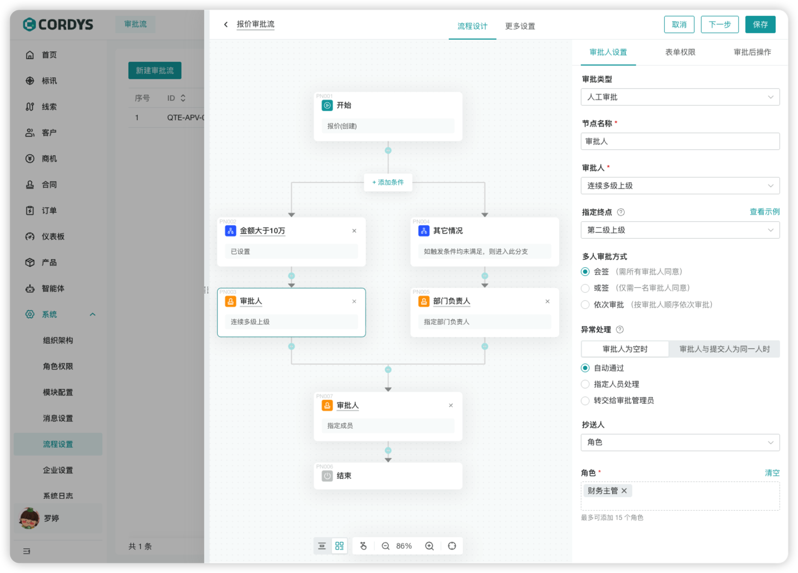

!!! Tip ""

    - 核心配置项详解

        - 审批类型
            - 人工审批：默认选项，由指定人员手动处理审批，适用于绝大多数业务场景
            - （其他类型如「自动通过 / 自动拒绝」，按需选择，本手册以人工审批为例）
        - 节点名称（必填）
            - 输入清晰易识别的节点名称，如「部门负责人审批」「财务主管终审」，便于流程维护与日志查看
            - 审批人（必填）
        - 支持多种审批人规则，可根据业务场景选择：
        
        | 审批人规则         | 适用场景                                       | 配置示例                                                     |
        | ------------------ | ---------------------------------------------- | ------------------------------------------------------------ |
        | 指定成员           | 固定由某一个/多个用户审批                      | 选择具体员工姓名，如「张三」「李四」                         |
        | 指定上级           | 固定由提交人的直属上级审批                     |                                                              |
        | 连续多级上级       | 按提交人组织架构的层级，自动获取上级审批       | 选择「第二级上级」，提交人的部门主管、上二级主管将按顺序审批 |
        | 指定部门负责人     | 由提交人所在部门的负责人审批                   | 自动匹配提交部门的负责人，无需手动维护                       |
        | 连续多级部门负责人 | 按提交人组织架构的部门，自动获取部门负责人审批 |                                                              |
        | 指定角色           | 由拥有特定角色（如财务主管、法务）的人员审批   | 选择「财务主管」角色，所有拥有该角色的用户均可审批           |

!!! Tip ""

    - 指定终点（仅多级上级和多级部门负责人时显示）
        - 当审批人选择「连续多级上级」时，需配置审批层级终点：
              - 例如选择「第二级上级」，表示审批流程将流转至提交人的上二级主管后结束，无需更高层级审批
              - 点击「查看示例」可直观了解层级对应关系
    - 多人审批方式（审批人为多人时生效）
          - 当配置了多个审批人时，需选择审批规则：
              - 会签（需所有审批人同意）：所有审批人全部通过，节点才会流转至下一步；任意一人驳回，流程直接结束
              - 或签（仅需一名审批人同意）：任意一名审批人通过，节点即流转至下一步
              - 依次审批（按顺序依次审批）：审批人按配置顺序依次处理，前一人通过后，流程才会发送给下一人；前一人驳回，流程直接结束
    - 异常处理
          - 用于定义审批流程中出现异常时的处理规则：
              - 审批人为空时：当系统无法匹配到审批人（如无上级、无角色用户）时，选择处理方式：
                - 自动通过：节点直接流转至下一步
                - 指定人员处理：固定由某用户兜底审批
                - 转交给审批管理员：由系统预设的审批管理员处理
              - 审批人与提交人为同一人时：当提交人与审批人为同一用户时，选择处理方式：
                - 自动通过：提交人提交后自动通过审批
                - 转交给上级处理：自动流转至提交人的上级审批
                - 由提交人对自己审批
    - 抄送人（选填）
          - 配置抄送人角色 / 用户，审批流程中关键节点（通过 / 驳回 ）将同步通知抄送人，抄送人仅查看，无审批权限
          - 支持按角色选择（如「财务主管」），系统将自动匹配所有拥有该角色的用户作为抄送人

!!! Tip ""

    - 表单权限
    「表单权限」是审批流节点的精细化配置项，用于定义当前节点的审批人 / 处理人对单据各字段的操作权限，控制字段在该节点是隐藏、仅可查看，还是可编辑。它能确保数据安全，避免敏感信息泄露或被误修改，常见于报价、合同、订单等业务审批流中。
    
    - **注意**：目前仅单行文本与多行文本类型的字段支持配置编辑权限。
    
    | 权限模式 | 说明                                                         | 适用场景                                                     |
    | -------- | ------------------------------------------------------------ | ------------------------------------------------------------ |
    | 隐藏     | 该字段对当前节点的处理人完全不可见，无法查看也无法编辑。     | 敏感信息（如公司内部成本、毛利数据）、与当前审批无关的冗余字段。 |
    | 查看     | 处理人仅能查看字段内容，无法修改，字段只为只读状态。         | 常规业务信息（如客户名称、报价日期），审批人仅需核对信息，无需修改。 |
    | 编辑     | 处理人可查看并修改字段内容，修改后的数据会同步更新到单据中。 | 审批人需补充/修正信息的场景（如财务审批修改报价金额、法务补充条款）。 |

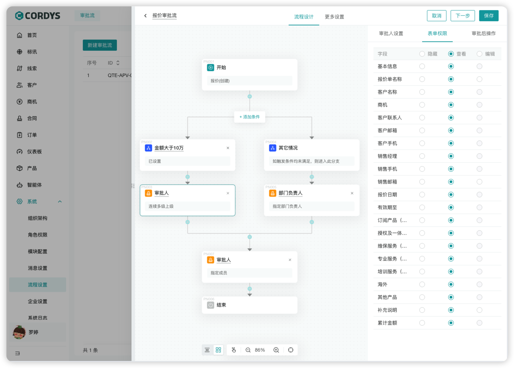

!!! Tip ""

    - 审批后操作
    「审批后操作」是审批流节点的自动化规则配置项，用于定义当前节点审批通过 / 驳回后，系统自动执行的动作，最常见的是「字段更新」，也可拓展至通知、状态变更等。它能减少人工操作，实现流程与数据的联动，例如审批通过后自动更新报价单有效期、状态等字段。

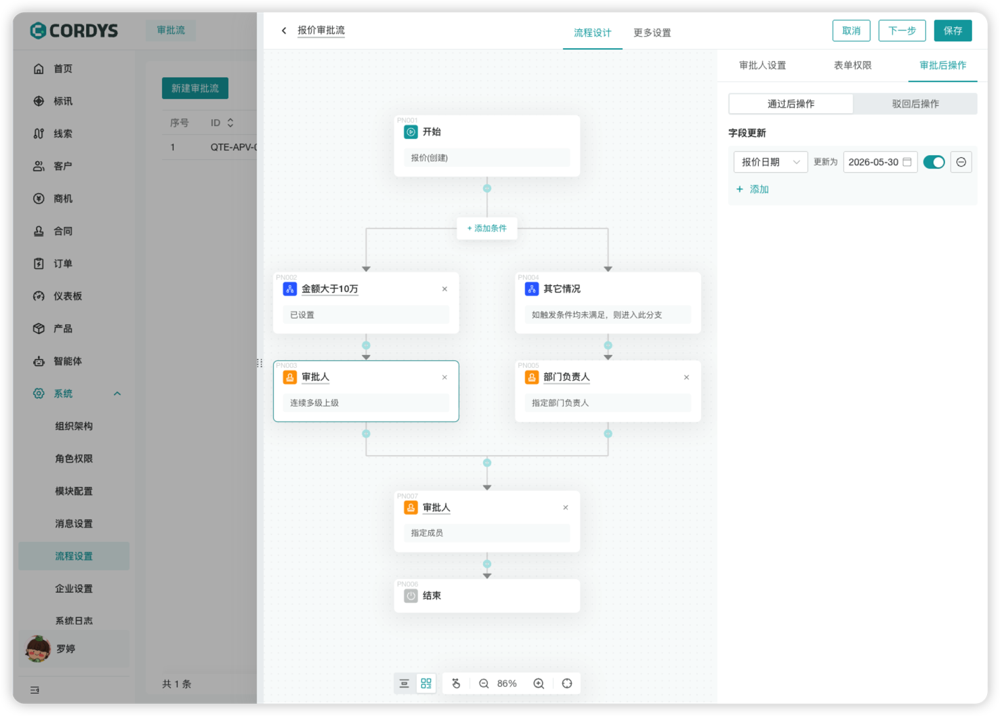

!!! Tip ""

    - **触发条件节点：**
        - 触发条件节点（也叫条件分支节点）是审批流的核心逻辑节点，用于根据业务单据的字段值，自动判断流程走向，实现 “不同条件走不同审批路径” 的复杂场景。例如 “报价金额大于 10 万走多级审批，否则走部门负责人审批”
        - 进入条件配置面板：点击条件分支的「设置」入口，弹出配置窗口，开始配置规则

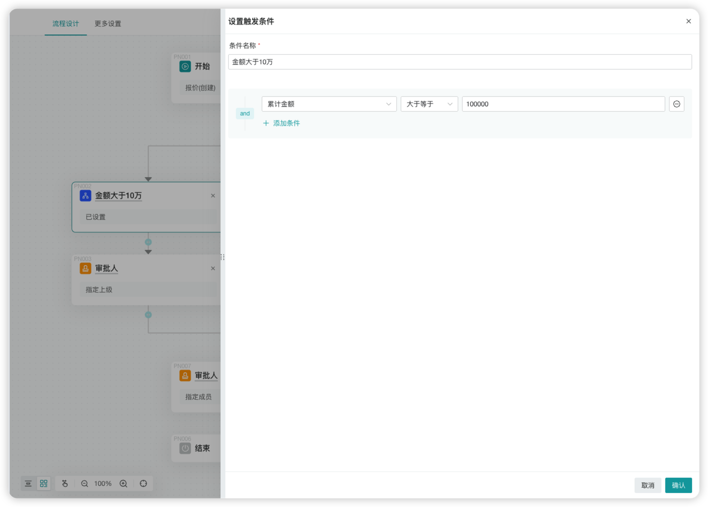

!!! Tip ""

    - **条件名称（必填）**
          - 为当前分支设置一个清晰易识别的名称，如「金额大于 10 万」「部门为销售部」
          - 该名称将显示在流程画布和审批日志中，方便快速识别分支逻辑
          - *示例：此处名称已设为「金额大于 10 万」，与下方配置的规则「累计金额 >= 100000」含义一致*

    - **条件规则配置（核心）**
        - 每条条件规则由「字段 + 运算符 + 值」三部分组成，可配置单个或多个组合条件。
            **① 配置单个条件**
                - 以「累计金额 >= 100000」为例，操作如下：
                  - **选择业务字段**：从第一个下拉框中选择单据字段，如「累计金额」「部门」「客户类型」
                  - **选择运算符**：从第二个下拉框中选择逻辑关系。常用运算符包括：
                    - 数值类：大于、大于等于、小于、小于等于、等于、不等于
                    - 文本类：包含、不包含、等于、不等于、为空、不为空
                    - 日期类：早于、晚于、等于、在范围内
                  - **输入条件值**：在值输入框中填写判断值，如「100000」（代表10万）
                  - **删除条件**：点击条件行右侧的「-」按钮即可删除当前条件

            **② 组合多个条件**
                - 当需要同时满足多个条件（如 “金额≥10万 且 部门为销售部”）时，可添加多条条件并设置逻辑关系：
                    - 点击「+ 添加条件」新增一行规则，按需配置字段、运算符和值
                    - 选择条件间的逻辑关系：
                        - **AND（且）**：所有条件同时满足，才触发当前分支（默认关系）
                        - **OR（或）**：任意一个条件满足即可触发分支
                        示例中默认采用 AND，表示后续添加的条件均需同时满足。

!!! Tip ""

    - **分支逻辑说明**
        - 条件节点配置完成后，会自动生成两个分支：
            - **条件分支**：满足所设规则的单据进入此分支（如金额≥10万的报价单，进入左侧多级审批流程）
            - **其他情况分支**：不满足任何条件的单据自动进入此分支（如金额＜10万的报价单，进入右侧部门负责人审批流程）
    
    **注意**：一个条件节点只能配置一组主条件。如需多条分支路径，可在流程中添加多个条件节点。

!!! Tip ""

    - **结束节点** 
        画布默认存在「结束」节点，无需额外配置。审批流程流转至此节点即表示审批全部完成。

### 1.3 更多设置

!!! Tip ""

    更多设置

      「更多设置」是审批流的全局配置模块，用于定义整个流程的通用权限规则、自动化逻辑和数据操作权限，这些配置对流程中的所有节点和参与者生效，是审批流安全与效率的关键补充。

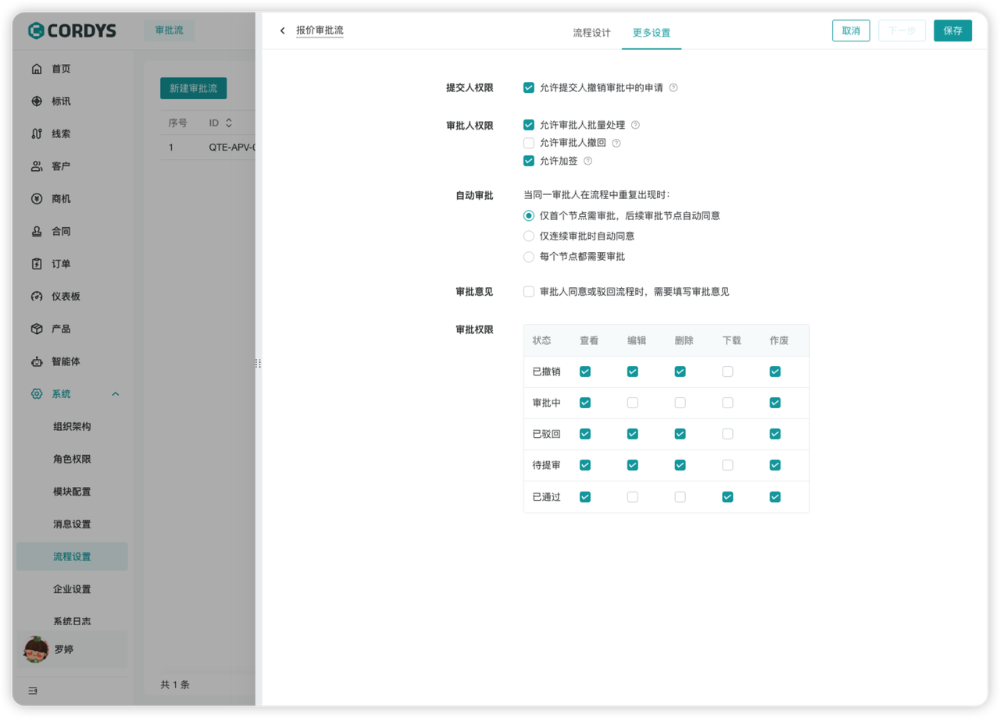

!!! Tip ""

     - 核心配置项详解
        - 提交人权限
            控制单据提交人在审批过程中的操作权限。
            - 允许提交人撤销审批中的申请：
                - 勾选后，提交人可在审批流程未结束前，主动撤销已提交的申请
                - 适用场景：提交人发现单据错误，需撤回修改后重新提交
                - 示例中已勾选此选项
        - 审批人权限
            定义审批人在流程中的操作权限。
            - 允许审批人批量处理：
                - 勾选后，审批人可批量处理多个待审批单据，提升处理效率
                - 示例中已勾选此选项
            - 允许审批人撤回：
                - 勾选后，审批人在提交审批意见（同意 / 驳回）后，可撤回操作重新处理
                - 示例中未勾选此选项，代表审批意见提交后不可修改
            - 允许加签：
                - 勾选后，审批人可在流程中临时添加其他人员参与审批
                - 示例中已勾选此选项，适用于需临时征求意见的复杂审批场景
        - 自动审批
            解决同一审批人在流程中重复出现的问题，避免重复审批。
            - 仅首个节点需审批，后续审批节点自动同意：
                - 审批人在流程中首次出现并处理后，后续所有由该审批人负责的节点将自动同意
                - 示例中已选择此选项，可避免多级审批中同一人重复审批的冗余操作
            - 仅连续审批时自动同意：仅当审批人节点连续出现时，后续节点自动同意
            - 每个节点都需要审批：审批人在流程中出现的每个节点都需手动处理，无自动同意
        - 审批意见
            控制审批人提交意见的强制规则。
            - 审批人同意或驳回流程时，需要填写审批意见：
                - 勾选后，审批人在同意 / 驳回时必须填写文字意见，否则无法提交
                - 示例中未勾选此选项，代表审批意见为选填项
        - 审批状态权限（状态 - 操作矩阵）
            定义不同状态下，单据可执行的操作权限（查看 / 编辑 / 删除 / 下载 / 作废），示例配置如下：
| 单据状态 | 查看 | 编辑 | 删除 | 下载 | 作废 |
| -------- | ---- | ---- | ---- | ---- | ---- |
| 已撤销   | ✅    | ✅    | ✅    | ❌    | ✅    |
| 审批中   | ✅    | ❌    | ❌    | ❌    | ✅    |
| 已驳回   | ✅    | ✅    | ✅    | ❌    | ✅    |
| 待提审   | ✅    | ✅    | ✅    | ❌    | ✅    |
| 已通过   | ✅    | ❌    | ❌    | ✅    | ✅    |

!!! Tip ""

     - 配置解读：
           - 所有状态下，单据均支持「查看」和「作废」
           - 「审批中」和「已通过」状态下，不允许「编辑 / 删除」，避免流程中数据被篡改
           - 「已通过」状态下，额外开放「下载」权限，便于导出归档
       
     - **注意** ：「更多设置」为流程全局配置，修改后将对所有未完结的流程生效
           - 审批权限矩阵需结合业务场景配置，避免过度开放权限导致数据安全风险
           - 自动审批规则需谨慎配置，避免因规则错误导致流程自动跳过关键审批节点

## 2 管理审批流

!!! Tip ""

      审批流列表是 Cordys 系统中管理所有审批流程的入口，可在此查看、新建、编辑、删除和搜索审批流，同时控制流程的启用 / 停用状态。

    | 字段      | 说明                                                         |
    | --------- | ------------------------------------------------------------ |
    | 序号 / ID | 系统自动生成的审批流唯一标识（如示例中的 QTE-APV-00001）     |
    | 业务类型  | 审批流关联的业务模块（如示例中的「报价」，表示该流程用于报价单审批） |
    | 流程名称  | 自定义的审批流名称，点击可进入编辑界面                       |
    | 状态      | 流程启用状态，绿色开关代表「已启用」，灰色代表「已停用」     |
    | 执行时机  | 流程触发场景（如示例中的「创建」，表示单据新建提交时触发审批） |
    | 操作      | 提供「编辑」「删除」功能                                     |

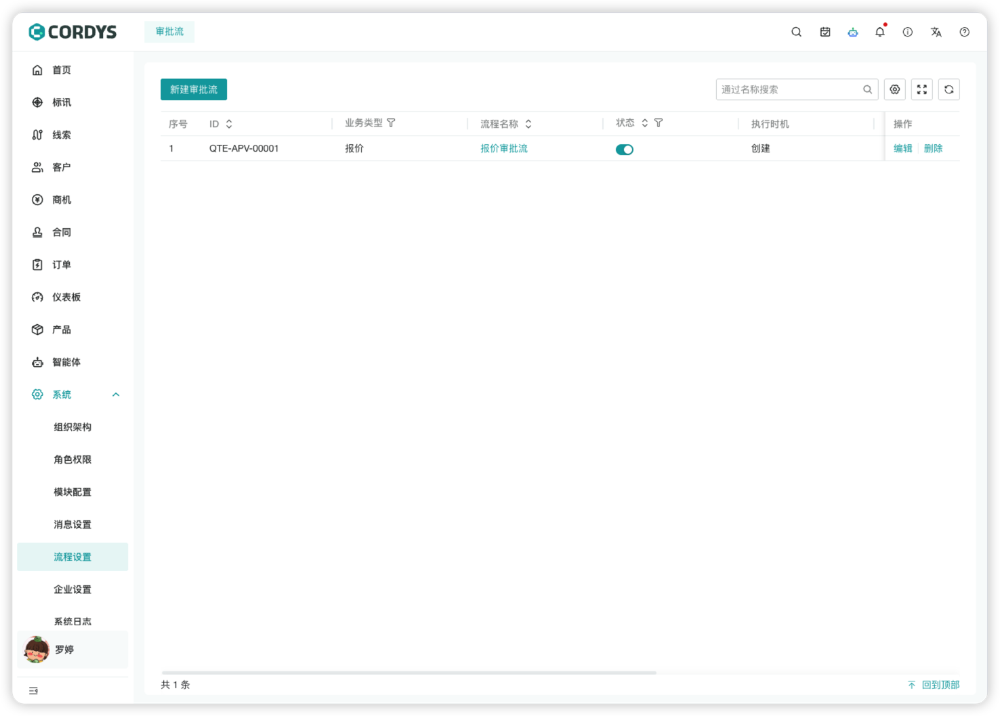

## 3 审批记录

!!! Tip ""

    配置并开启相应业务的审批流后，满足执行时机的数据即可触发审批，本文档以「报价」为例，其它模块均相同。

### 3.1 新建报价

!!! Tip ""

    报价审批流的执行时间为创建，在新建报价时，表单展示「提审」按钮。

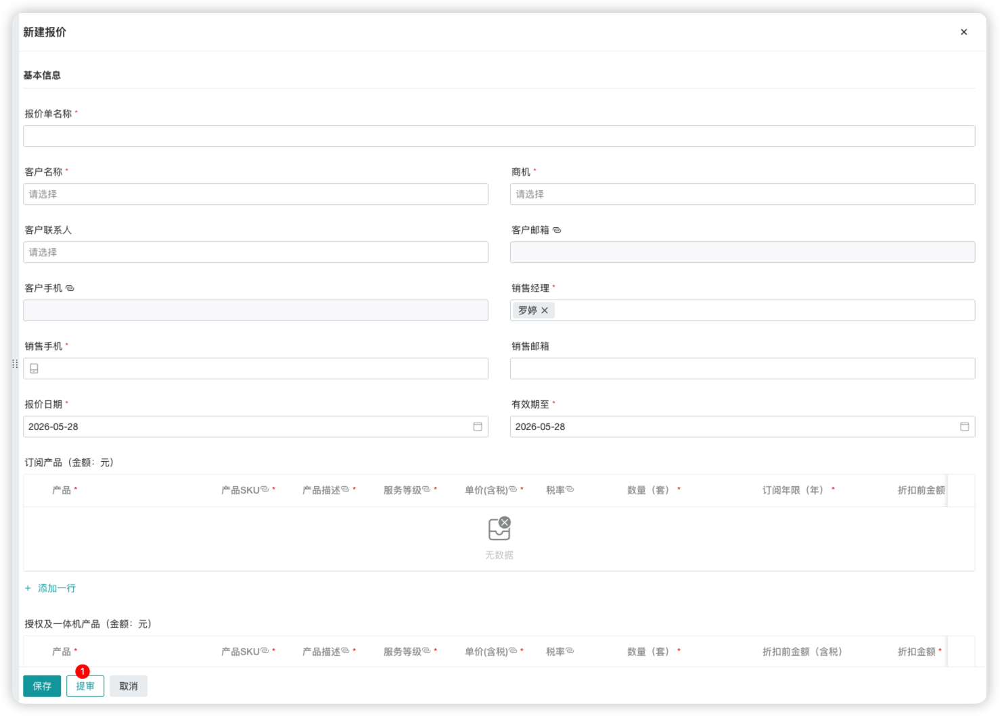

!!! Tip ""

    保存新创建的报价，在报价列表可以看到创建的数据审批状态为「待审批」，用户可以进行提审操作，系统会修改审批状态为「审批中」，该条数据正式进入审批流程。

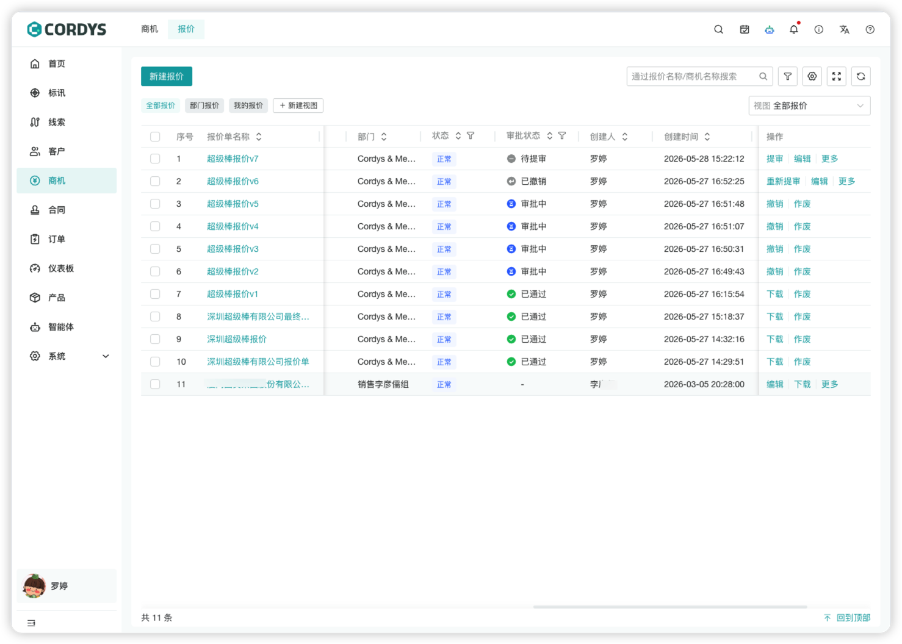

### 3.2 提审人视角

!!! Tip ""

      提审人点击报价详情， 右侧展示审批记录，审批记录页面用于展示单据的完整审批流程进度、参与人员及审批状态，是提交人、审批人追踪审批进度的核心界面。示例中展示了一个包含「会签」和「或签」两种审批模式的流程。
      - 提审人在审批人审批前可以进行「撤销」操作
      - 流程节点与状态解读
          - 提交申请节点
             - 提交人：罗婷
             - 提交时间：2026-05-28 15:25
             - 状态：已完成（流程发起）
          - 第一级审批节点（会签模式）
             - 审批模式：会签（需所有审批人同意）
             - 状态：审批中
             - 审批人列表：白奇、王旭
             - 规则解读：会签模式下，所有审批人必须全部同意，节点才能流转至下一步；任意一人驳回，流程将直接结束
             - 当前进度：节点处于审批中状态，说明至少有一位审批人尚未处理（或正在处理）
          - 第二级审批节点（或签模式）
             - 审批模式：或签（仅需一名审批人同意）
             - 状态：待审批
             - 审批人列表：宋昌昌、宋天阳、赵勇
             - 规则解读：或签模式下，任意一名审批人同意，节点即可流转至下一步；无需等待所有审批人处理
             - 当前进度：节点处于待审批状态，需等待上一级会签节点完成后，才会进入此节点的审批流程
          - 结束节点
             - 流程的终点，所有审批节点完成后，单据将流转至此节点，代表审批流程结束

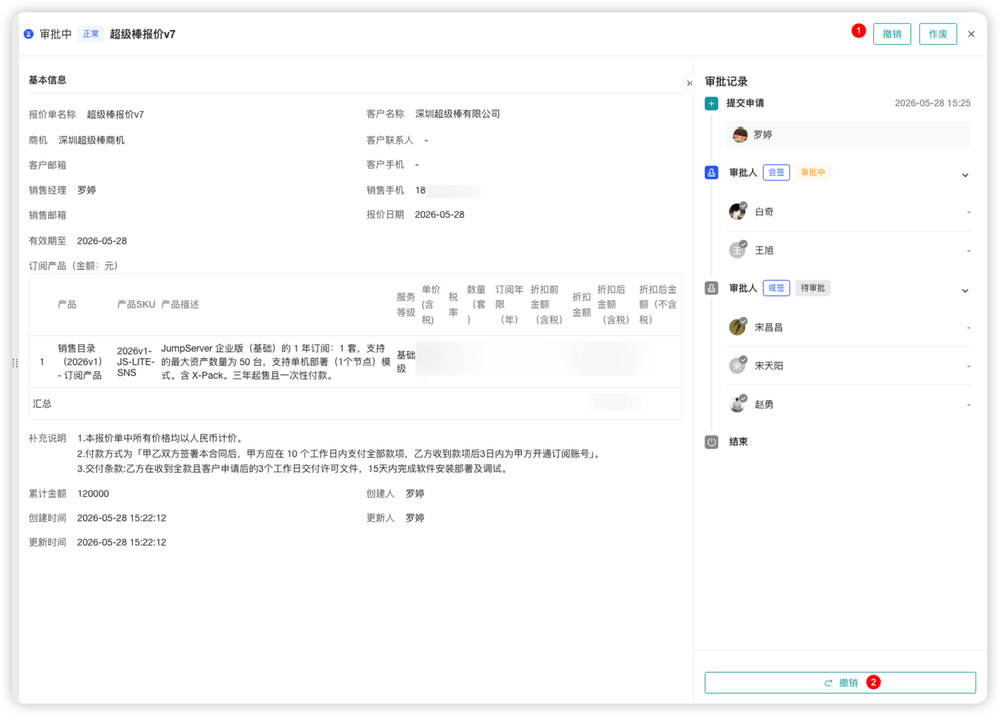

### 3.3 审批人视角

!!! Tip ""

      审批人在「首页-我的待办」以及「消息通知」均会收到提醒。

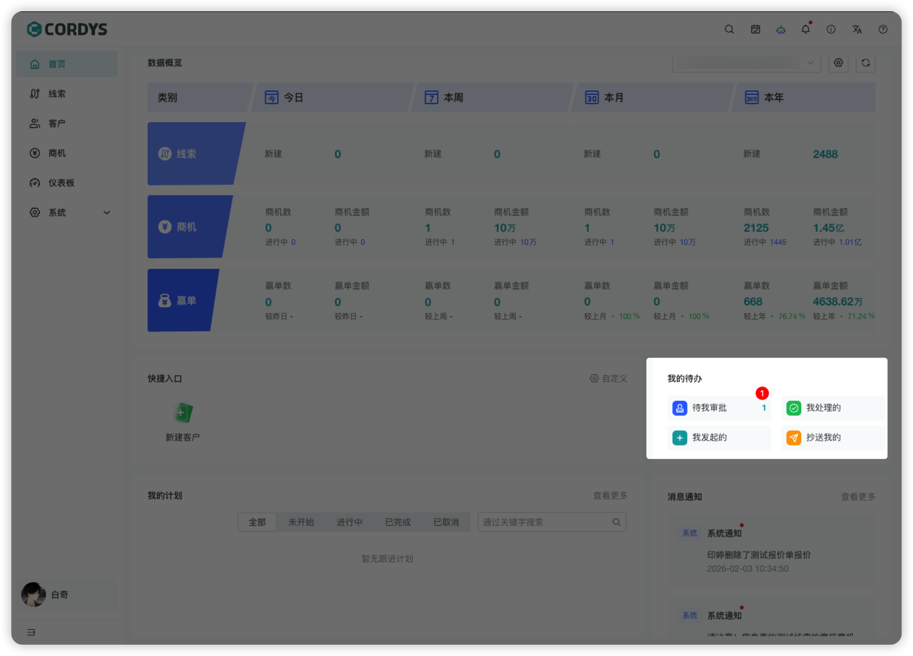

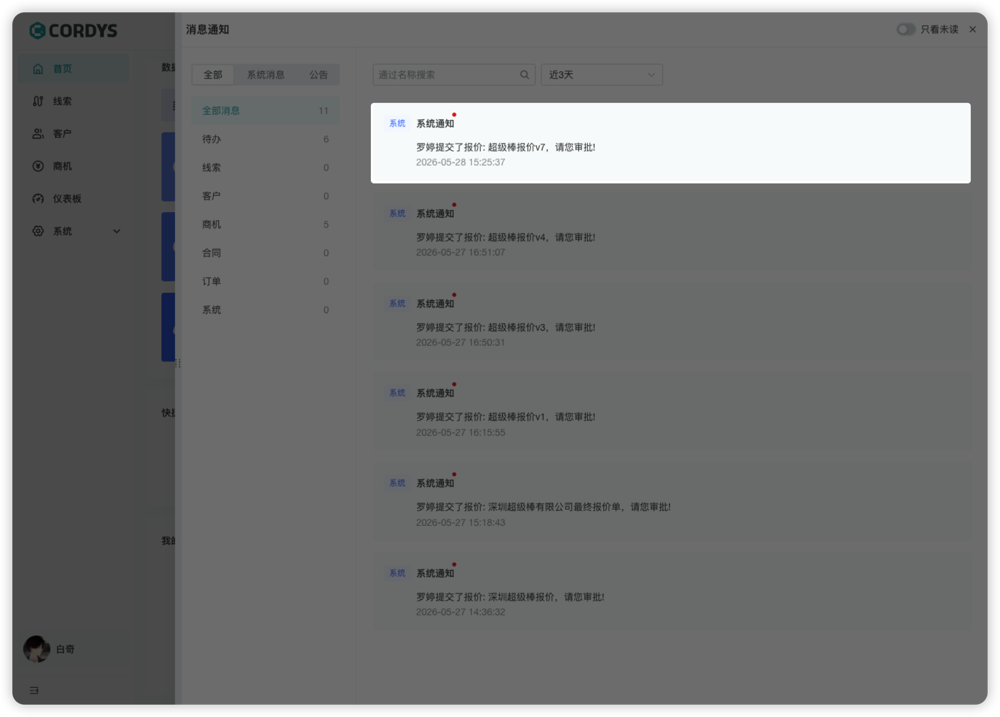

!!! Tip ""

      进入「我的待办」点击报价名称，进入审批详情页。

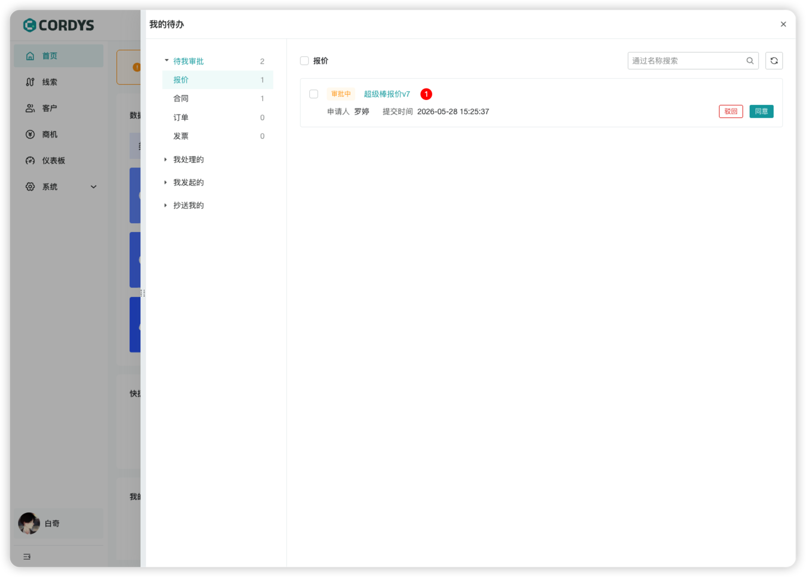

!!! Tip ""

     审批人可以在更多操作中进行「加签/退回」操作， 也可以对当前审批单进行同意/驳回操作。

     **注意**：第一个审批节点不支持退回操作。

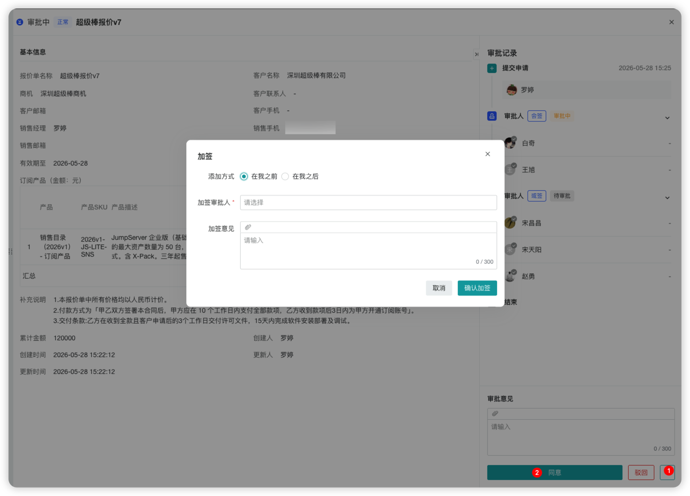

### 3.3 报价审批完成

!!! Tip ""

     提审人在消息通知会收到审批通过的消息。

!!! Tip ""

       报价完成后，顶部左侧会展示「已通过」状态，右侧展示完整审批过程。

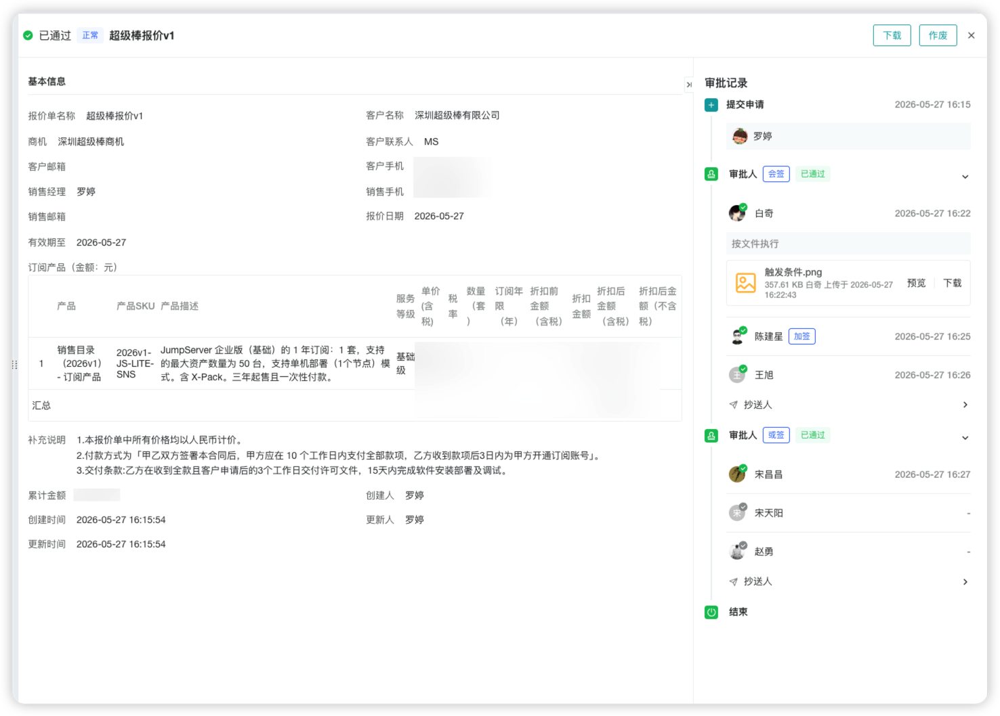

