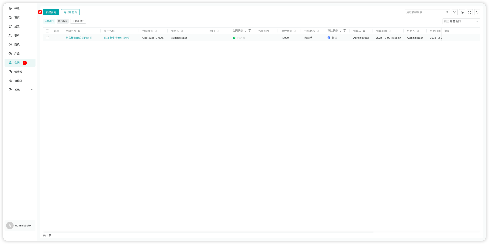
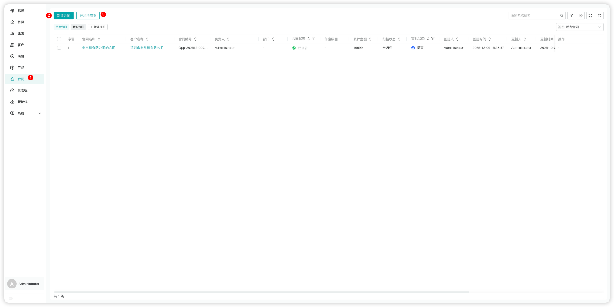
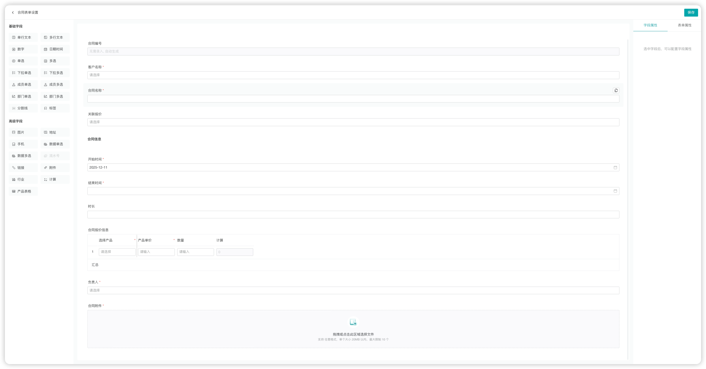
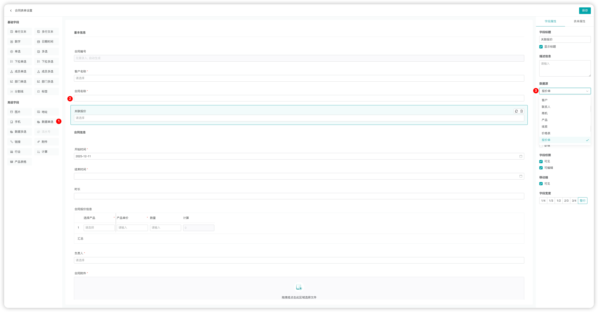
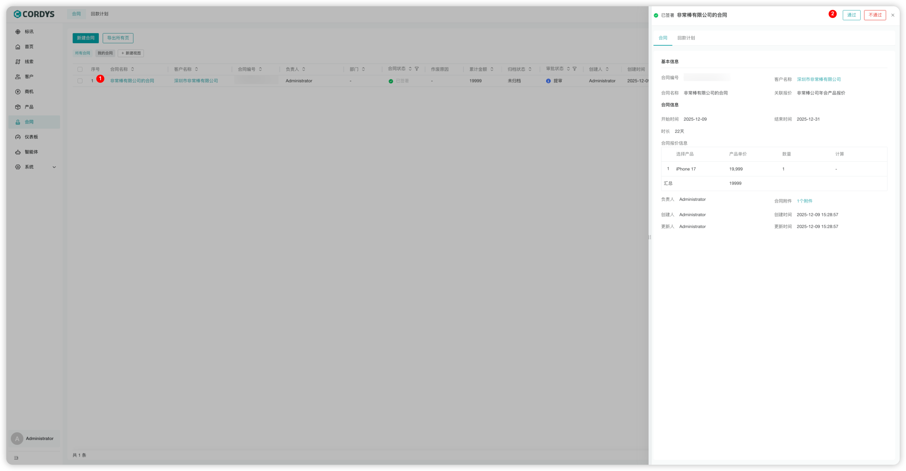

## 合同

### 新建合同

!!! Abstract ""

    在左侧菜单点击【合同】，进入合同管理页面。

!!! Abstract ""

    用户可以「新建合同」或「导出合同」。

!!! Abstract ""

    **提示**：合同表单可以根据公司业务特性在表单设置中进行自定义。

### 合同关联其他模块

!!! Abstract ""

    管理员进入【系统-模块设置】，点击「合同表单设置」，选择「数据源」，设置要关联模块。
    

!!! Abstract ""

    用户完成合同创建后，有权限的角色或者人员，可以进行简单的审批。
