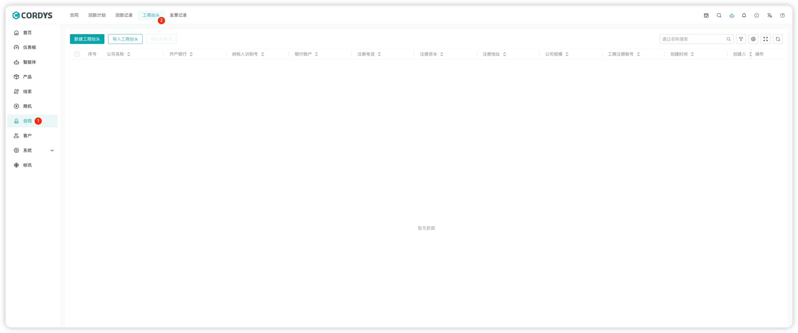
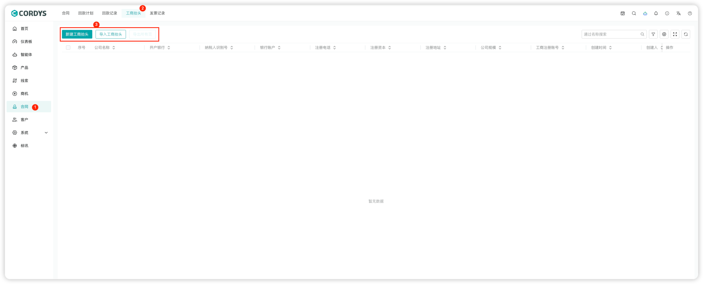
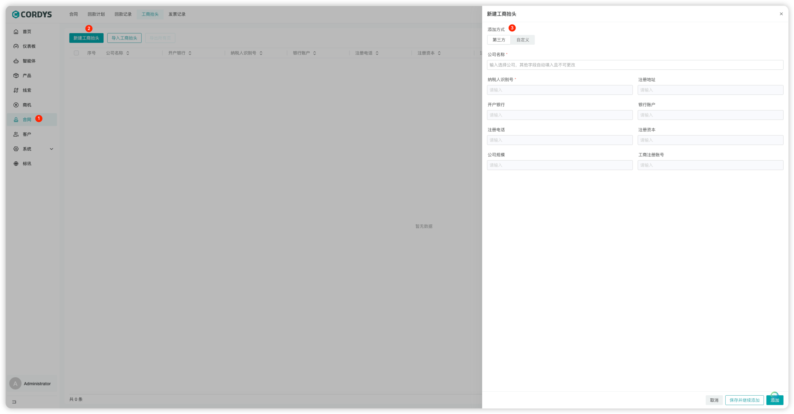
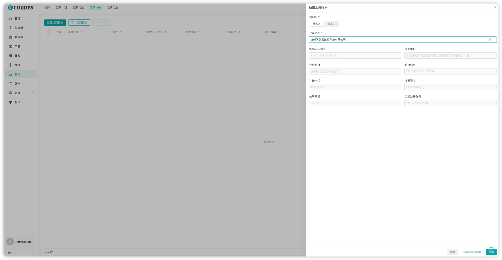
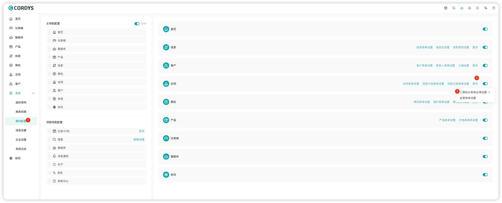

### 新建工商抬头

!!! Abstract ""

    在左侧菜单点击【合同】，选择顶部工商抬头标签，进入工商抬头页面。
)

!!! Abstract ""

    用户可以「新建工商抬头」「导入工商抬头」或「导出工商抬头」。

!!! Abstract ""

    在左侧菜单点击【合同】，顶部选择工商抬头标签，进入工商抬头理页面。可以选择关联第三方查询或自定义；

!!! Abstract ""

    选择第三方，输入公司名称，会自动查询并带入公司相关信息。

### 工商抬头页面配置
!!! Abstract ""

    **提示**：工商抬头表单可以根据公司业务特性在表单设置中进行必填项目配置。

