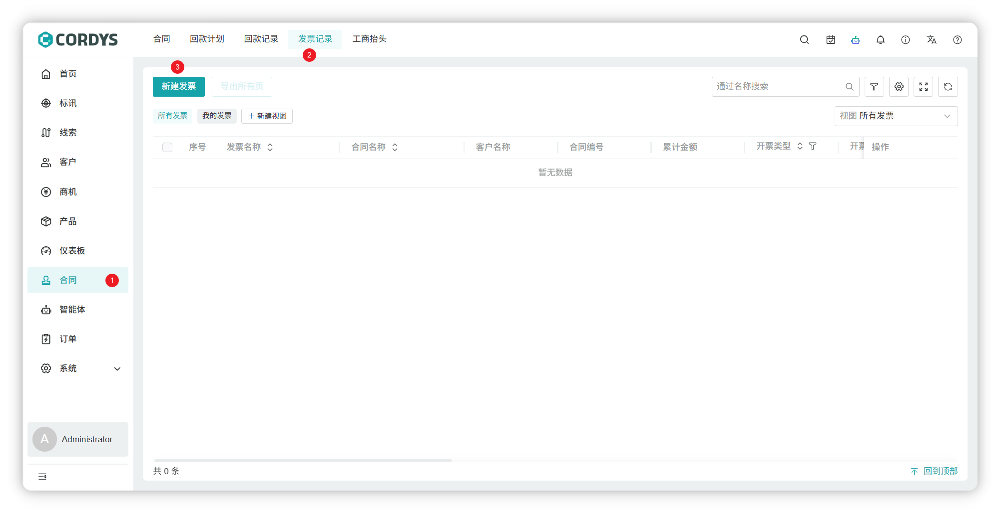
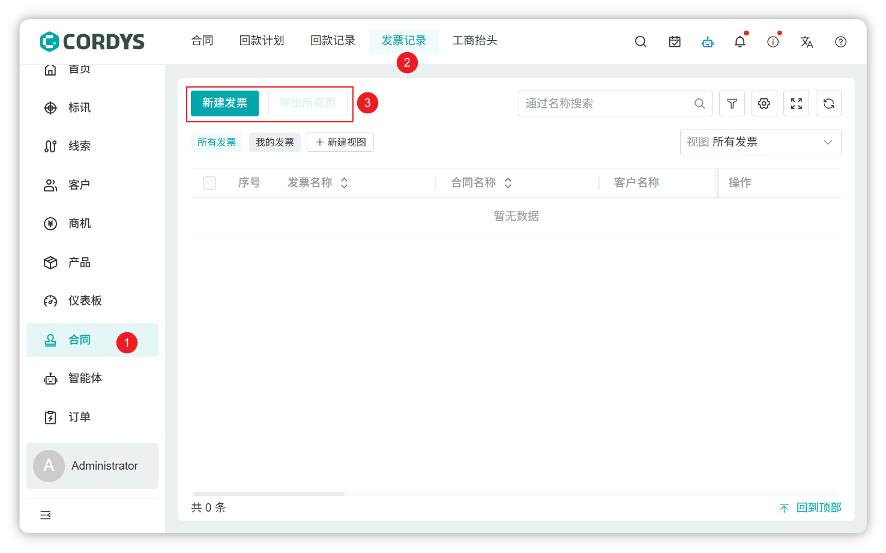
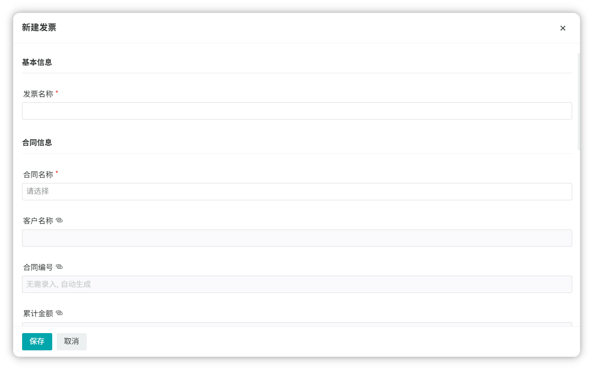
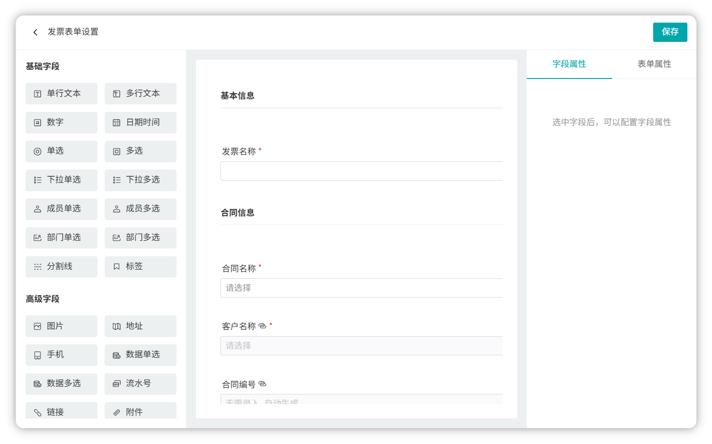
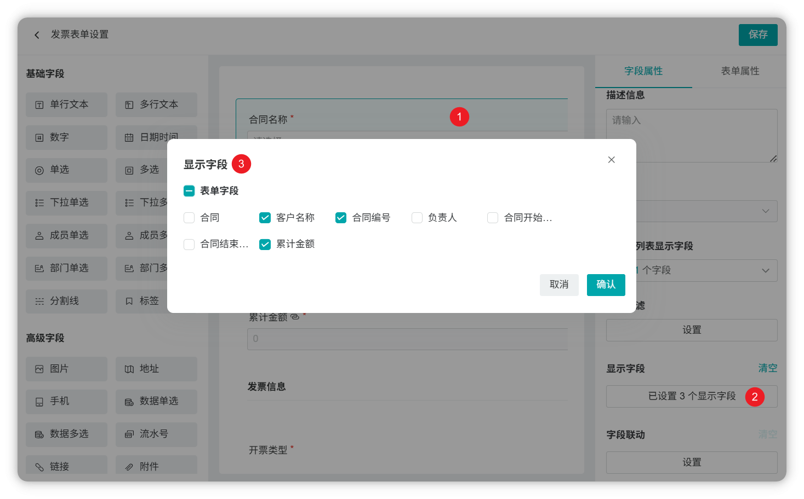

## 1 新建发票记录

!!! Tip ""

    在左侧菜单点击【合同】，选择顶部发票记录标签，进入发票记录页面。

!!! Tip ""

    用户可以「新建发票」或「导出发票」。

!!! Tip ""

    在左侧菜单点击【合同】，顶部选择回款计划标签，进入发票记录管理页面，选择新建发票。

## 2 发票记录配置

!!! Tip ""

    **提示**：发票表单可以根据公司业务特性在表单设置中进行自定义。

!!! Tip ""

    管理员进入【系统-模块设置】，点击「发票表单设置」，选择「合同名称」，设置显示字段。

