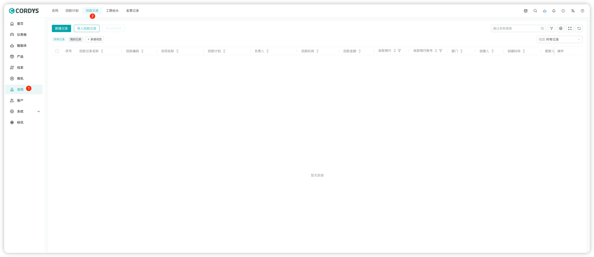
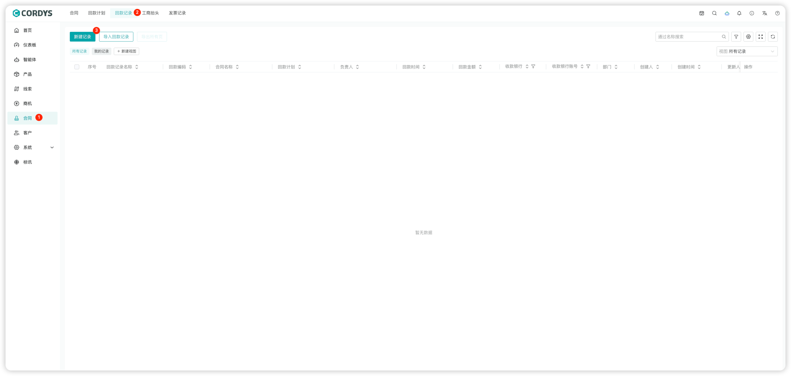
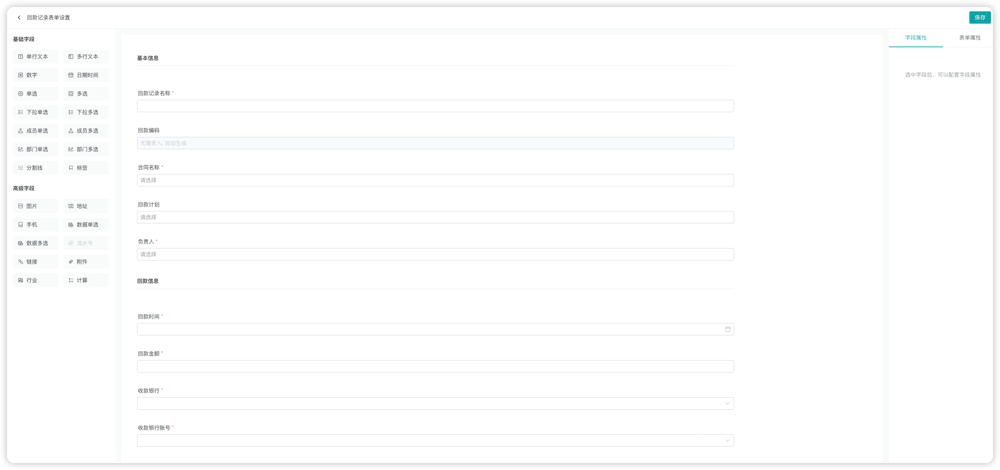

## 回款记录

### 新建回款记录

!!! Abstract ""

    在左侧菜单点击【合同】，选择顶部回款记录标签，进入回款记录页面。

!!! Abstract ""

    用户可以「新建回款记录」「导入回款记录」或「导出回款记录」。

### 回款记录表单配置

!!! Abstract ""

    **提示**：回款记录表单可以根据公司业务特性在表单设置中进行自定义。

!!! Abstract ""

    管理员进入【系统-模块设置】，点击「回款记录表单设置」，选择「合同名称」，设置显示字段。
    

