# 飞书对接

## 飞书配置

!!! Abstract ""

    #### 1. 飞书管理员权限

    需要使用“飞书管理员账号”（或具有通讯录管理权限的子管理员），普通成员账号无法创建应用或同步通讯录。

    #### 2. 登录 [飞书管理后台](https://open.feishu.cn/app) 创建应用：

    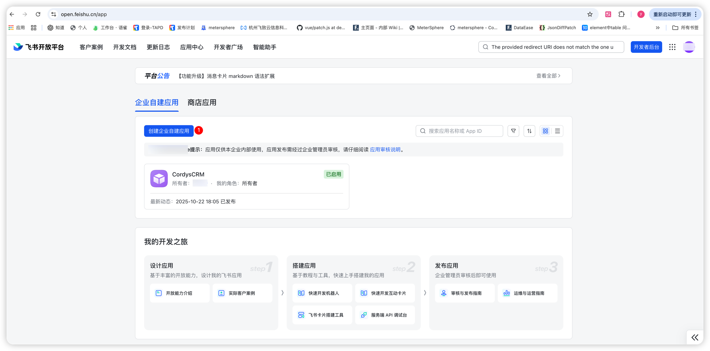
      
    #### 3. 获取应用凭证

    创建自建应用后，在后台点击应用卡片，查看应用详情-应用凭证与基础信息，并获取以下关键凭证：

     - 点击应用详情获取配置信息：
         - 应用的 App ID (应用id)
         - 应用的 App Secret  (应用密钥)

      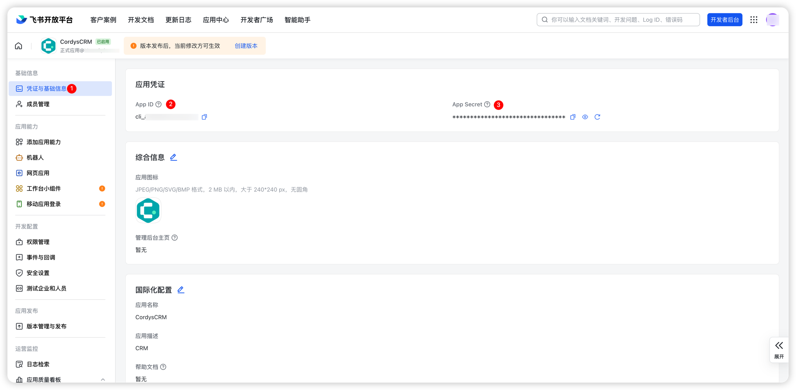
    
    点击功能菜单按钮，选择管理后台选项，获取企业信息：

     - 企业编码（CorpID）

      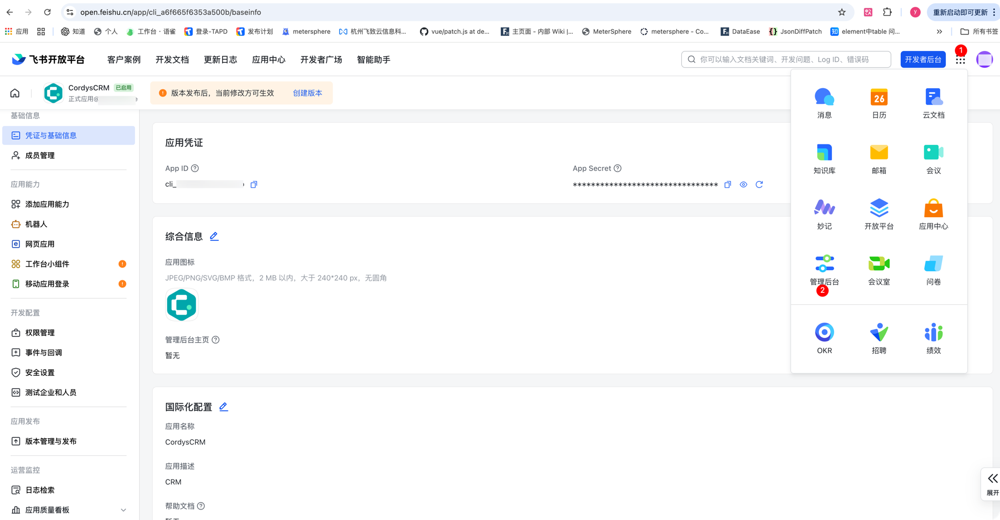
      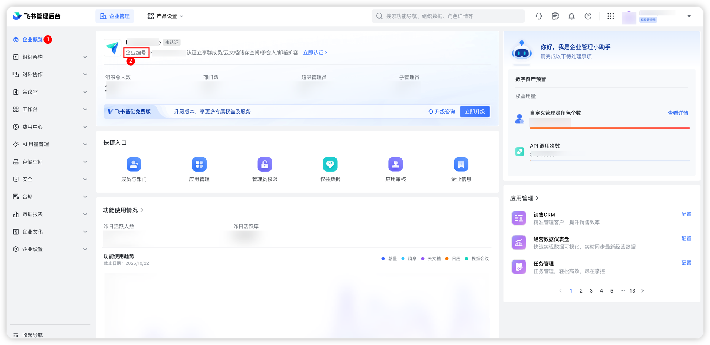

    #### 4. 配置通讯录 API 权限

      在权限管理页面为应用开启 API 权限。常见需要的权限包括：

      - 企业信息-获取企业信息（同步组织结构时获取您的企业名称，否则会赋予统一默认值-公司名称）
      - 组织架构-应用身份权限-调用API功能相关权限以及获取员工邮箱权限（同步组织结构，员工邮箱权限可自选）
      - 组织架构-用户身份权限-调用API功能相关权限以及部门信息相关读取权限（同步组织结构）
      - 通讯录-获取通讯录，部门，用户基本信息，获取通讯录部门组织架构， 用户组织架构信息， 获取用户 user ID（同步组织结构）
      - 消息与群组-获取与发送单聊、群组消息，以应用的身份发消息（Cordys CRM 通过应用发送通知）

      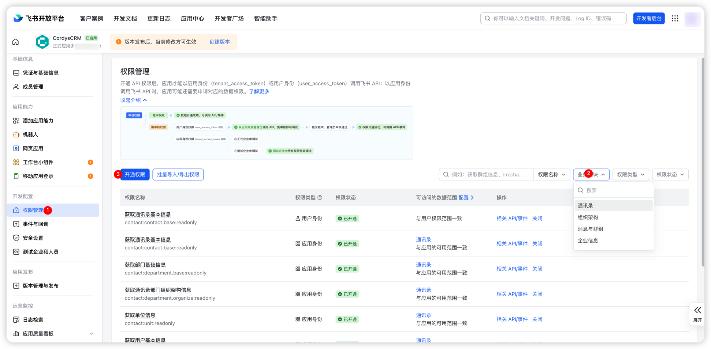

    
    #### 5. 安全设置

      - 重定向URL-添加重定向 URL 作为免登授权码跳转地址。其他重定向 URL 将无法获取免登授权码。（必须添加 Cordys CRM 可访问的域名，eg:https://example.com (域名后缀不要有/)，如需在移动端访问，还需添加 Cordys CRM 可访问的移动端URL，eg:https://example.com/mobile）
      - IP白名单-开启 IP 白名单后，仅白名单中的来源请求可以正常调用开放平台 API，不在白名单中的来源请求会被拒绝
      - H5可信域名-添加可信域名，确保在飞书内访问时不会被拦截

      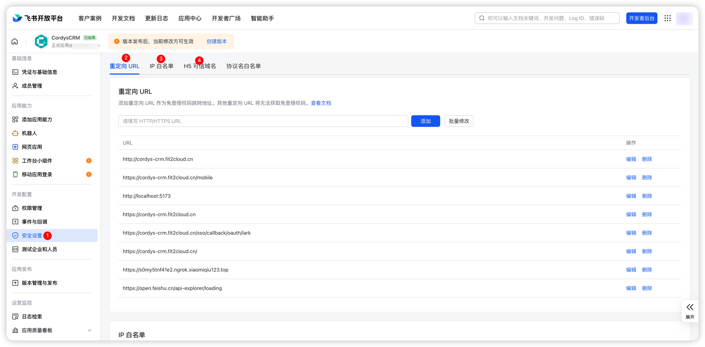

    #### 6. 应用能力
    
    - **添加应用能力**
        - 添加网页应用（此功能可选）。如果需要在飞书工作台访问 Cordys CRM，则必须添加此功能。
        - 添加机器人（此功能可选）。如果需要在飞书接收 Cordys CRM 通知，则必须添加此功能。
        - 注意：如果机器人应用与网页应用同时开启，则打开应用时需要点击机器人应用图标，选择打开应用。（客户端与移动端都是如此）
    
      - **配置网页应用**
          - **桌面端主页**   
            `https://open.feishu.cn/open-apis/authen/v1/authorize?app_id=cli_****************&redirect_uri=https%3A%2F%2F你的域名&state=LARK`

          - **移动端访问地址**  
            `https://open.feishu.cn/open-apis/authen/v1/authorize?app_id=cli_****************&redirect_uri=https%3A%2F%2F你的域名&state=LARK`

    
        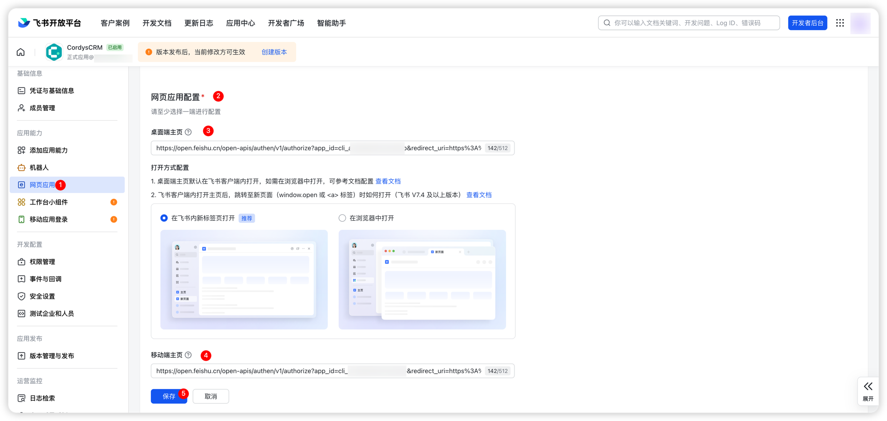

    #### 7. 数据准备

      确认外部系统中的部门、成员数据字段与飞书字段对应：

      - 部门 ID、父部门 ID、部门名称
      - 成员账号（userid）、姓名、职位

## Cordys CRM 配置同步组织架构

### 配置飞书信息

!!! Abstract ""

    

### 同步飞书组织架构

!!! Abstract ""

    1. 点击【系统】菜单，进入【组织架构】页面
    2. 点击「更多」按钮下的「飞书同步」选项，系统将自动触发同步流程
    3. 同步完成后，页面左侧的组织架构区域将自动展示从飞书同步过来的完整组织架构

    **后续维护说明**：当飞书中新增成员或调整组织架构后，只需重复执行上述「飞书同步」操作，即可完成最新组织架构的更新。

    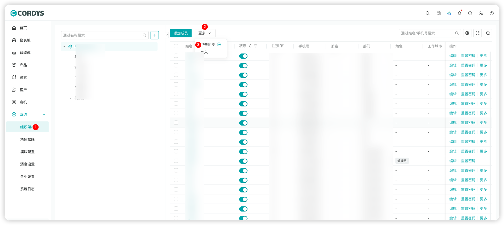

    #### 重要提醒：

       - 所有飞书配置均需要应用发布成功后生效
         
      👉 飞书官方文档：[通讯录同步](https://open.feishu.cn/document/server-docs/contact-v3/department/children)

      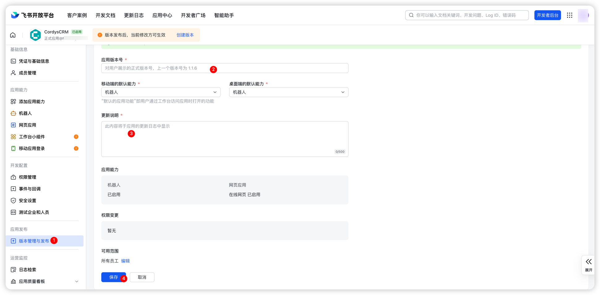

## 飞书工作台访问 Cordys CRM

!!! Abstract ""

    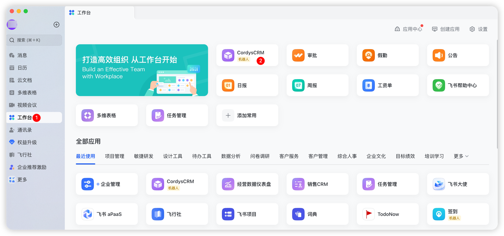

    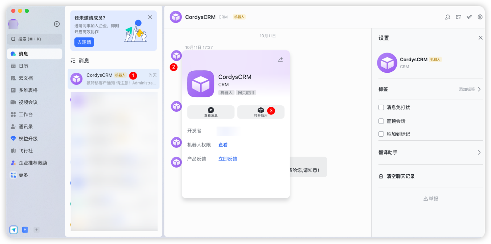
