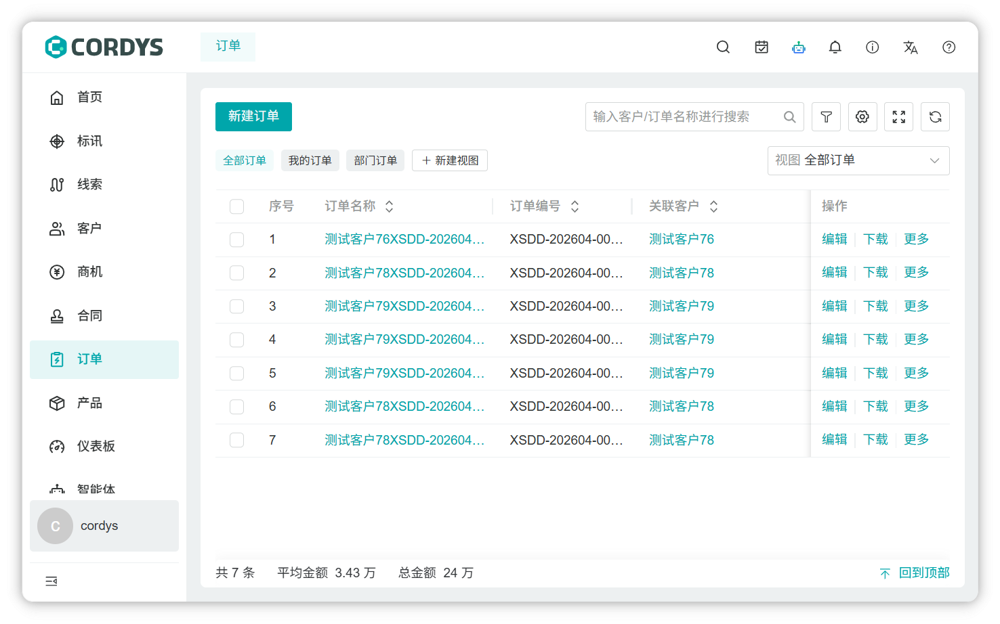
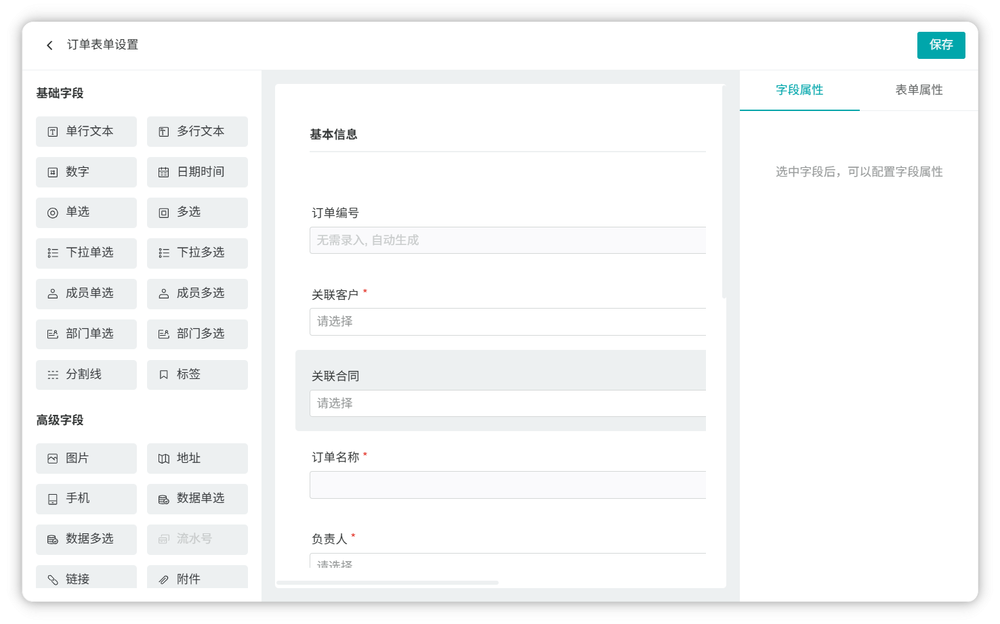
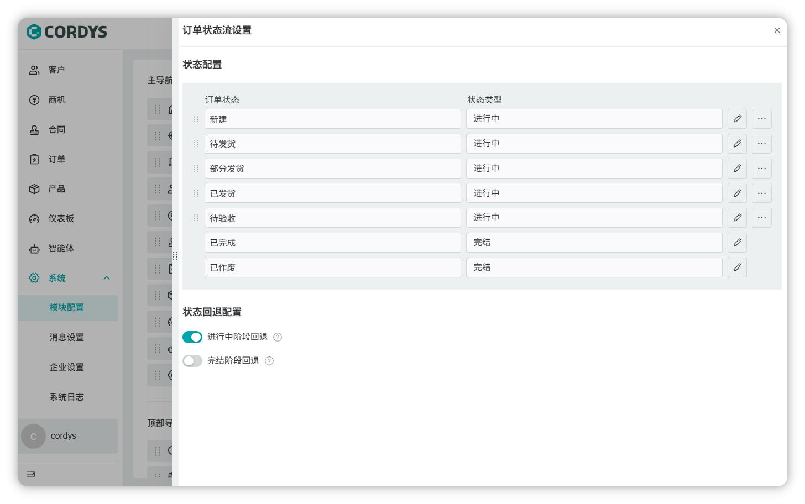
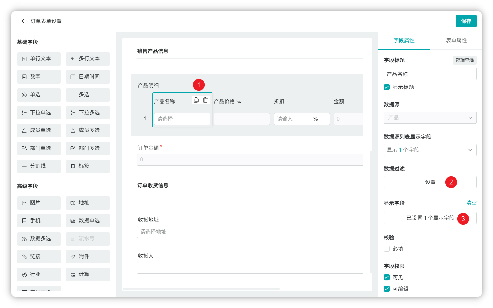
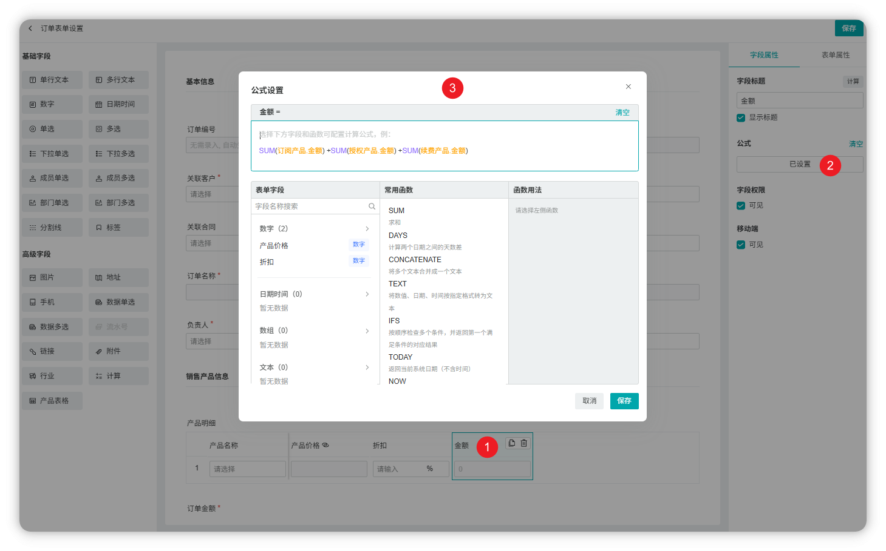
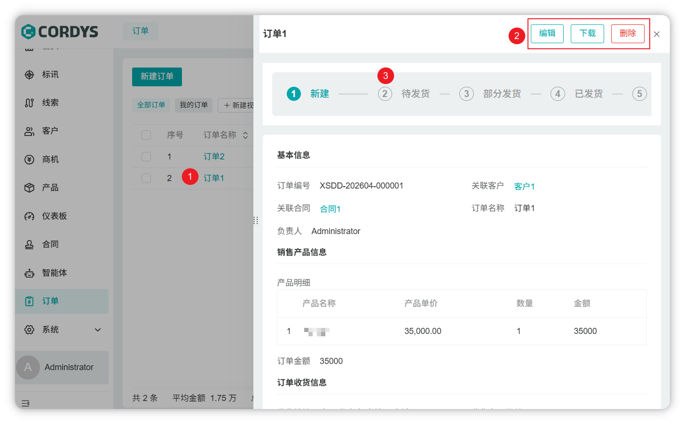

## 1 订单新建

!!! Tip ""

    在左侧菜单点击【订单】，即可进入订单新建页面。

!!! Tip ""

    **提示**：订单表单、订单状态流可以根据公司业务特性在表单设置中进行自定义。

!!! Tip ""

    **订单表格-数据源字段**：

    - 订单表格内置产品数据源字段和价格表数据源字段
    - 数据过滤：设置数据过滤规则，根据规则展示产品列表
    - 显示字段：设置选择产品时，同步显示关联的字段，依次展示在表格列中
    
    **订单表格-产品定价的三种配置方式**：

    - 在订单表中添加”产品定价“自定义字段，手动录入产品价格
    - 在产品模块中维护产品价格，通过产品数据源的显示字段属性，勾选产品定价带入到当前表格展示
    - 在订单表中维护产品价格，通过价格表数据源的显示字段属性，勾选产品定价带入到当前表格展示，根据选择的产品动态获取价格

    **订单表格-计算（金额）字段**：

    - 选择当前表格可参与计算的字段（数字类型）
    - 通过运算符组合成完整公式

## 2 订单详情

!!! Tip ""

    点击订单名称，进入订单详情页面，用户可根据订单跟进情况修改订单状态

